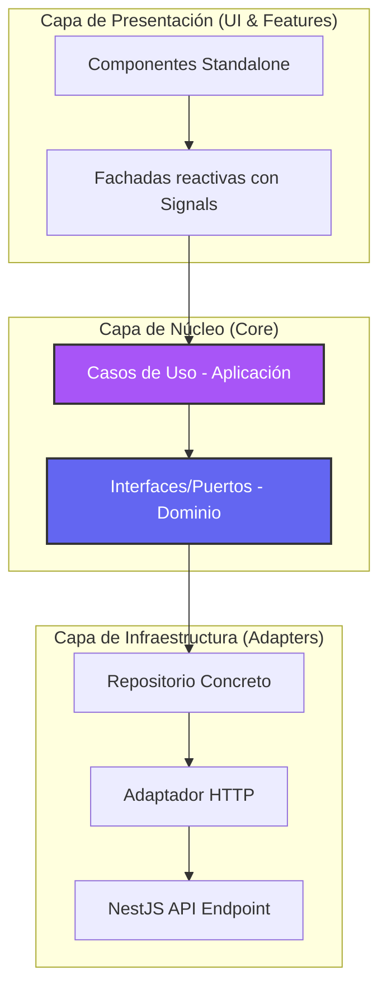

# Especificación de Arquitectura — Frontend (Angular v21)

Este documento detalla el diseño arquitectónico del frontend de **DevPortfolio Pro**, estructurado bajo los principios de **Arquitectura Hexagonal (Puertos y Adaptadores)** y **Domain-Driven Design (DDD)**. El objetivo principal es garantizar la mantenibilidad, desacoplamiento, testabilidad y escalabilidad del software a largo plazo.

---

## 1. Patrón Arquitectónico: Hexágono (Puertos y Adaptadores)

La aplicación se divide en capas concéntricas. La regla de dependencia fundamental dicta que **las capas internas no pueden conocer nada de las capas externas**. Todo el acoplamiento se realiza apuntando hacia el núcleo (Dominio).



---

## 2. Responsabilidades por Capa

### A. Capa de Dominio (`src/app/core/domain`)
Es el núcleo del software. Contiene las reglas y abstracciones de negocio puras. No tiene dependencias de librerías de UI (PrimeNG), enrutadores o clientes de red (`HttpClient`).
* **Puertos (Interfaces de Repositorios)**: Definen las firmas de los métodos y operaciones que la aplicación necesita para persistir o recuperar datos.
  * *Ejemplo*: `IToolsRepository` define la abstracción de operaciones para las herramientas de desarrollo.

### B. Capa de Aplicación (`src/app/core/application`)
Orquesta el flujo de datos hacia y desde la capa de dominio. Ejecuta la lógica del negocio correspondiente a tareas específicas.
* **Casos de Uso (`use-cases`)**: Clases de grano fino con una única responsabilidad (`execute`), inyectables y testeables de forma aislada.
  * *Ejemplo*: `Base64UseCase` inyecta el puerto `IToolsRepository` y llama a su método `encodeDecodeBase64()`.

### C. Capa de Infraestructura (`src/app/core/infrastructure`)
Contiene los detalles técnicos y adaptadores para interactuar con agentes externos (como la API NestJS del backend, LocalStorage, etc.).
* **Adaptadores (`adapters`)**: Consumen el servicio `HttpClient` para realizar peticiones HTTP de red y formatear payloads.
* **Repositorios Concretos (`repositories`)**: Implementan las interfaces (puertos) del Dominio, resolviendo las promesas/observables de los adaptadores.
  * *Ejemplo*: `ToolsRepository` implementa `IToolsRepository` y delega la ejecución de red a `ToolsHttpAdapter`.

### D. Capa de Características / UI (`src/app/features`)
Representa la capa de presentación que interactúa de forma directa con el usuario final.
* **Fachadas (`services/facades`)**: Servicios singleton (`providedIn: 'root'`) que encapsulan el estado de la UI utilizando **Angular Signals**. Aislan a los componentes del conocimiento de los Casos de Uso.
* **Componentes Standalone**: Componentes desacoplados encargados únicamente de pintar la UI y reaccionar a las señales expuestas por las fachadas.

---

## 3. Inversión de Dependencias (DI)

Para evitar que la capa de aplicación o presentación se acople a la infraestructura concreta, la aplicación se apoya en el contenedor de **Inyección de Dependencias de Angular**.

Las dependencias se resuelven en el archivo de configuración global `app.config.ts`:

```typescript
// app.config.ts
import { IToolsRepository } from '@core/domain/repositories/tools.repositories.interface';
import { ToolsRepository } from '@core/infrastructure/repositories/tools.repository';

export const appConfig: ApplicationConfig = {
  providers: [
    // Vinculación de Puerto (Dominio) con Adaptador Concreto (Infraestructura)
    {
      provide: IToolsRepository,
      useClass: ToolsRepository
    }
  ]
};
```

---

## 4. Gestión del Estado Reactivo (Angular Signals)

En lugar de utilizar complejas arquitecturas de almacenes de estado global (como NgRx) para flujos locales, o suscripciones manuales a RxJS que propicien fugas de memoria, implementamos **Angular Signals**:

1. **Signals de Estado (`signal`)**: Almacenan valores primitivos u objetos mutables (ej. resultados de procesamiento, mensajes de error, estados de carga).
2. **Computed Signals (`computed`)**: Señales de solo lectura derivadas del estado primario (ej. `isLoading = computed(() => this.status() === 'loading')`).
3. **Flujo Unidireccional**: Los componentes invocan métodos de acción en la fachada; la fachada ejecuta el caso de uso, actualiza el signal correspondiente y el componente se re-renderiza automáticamente.

---

## 5. Estructura de Directorios (Resumen)

```bash
src/app/
├── core/                       # Núcleo de la aplicación (DDD)
│   ├── domain/                 # Entidades e Interfaces de Repositorios (Puertos)
│   ├── application/            # DTOs y Casos de Uso
│   └── infrastructure/         # Repositorios concretos y Adaptadores de red
├── features/                   # Módulos y pantallas de usuario
│   ├── dashboard/              # Página de inicio del Panel de Control
│   ├── tools/                  # Herramientas (Base64, UUID, QR, contraseñas, etc.)
│   └── snippets/               # Gestor de fragmentos de código
└── shared/                     # Componentes y layouts compartidos
```
